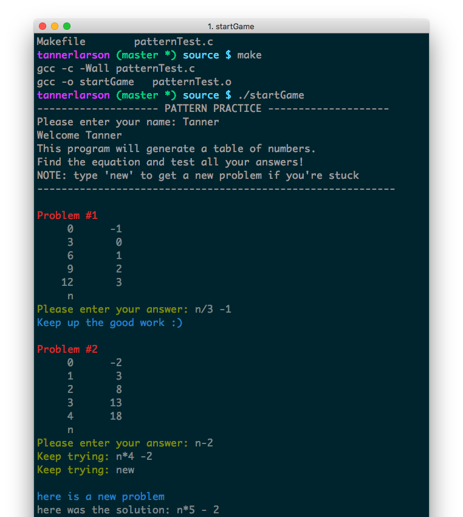
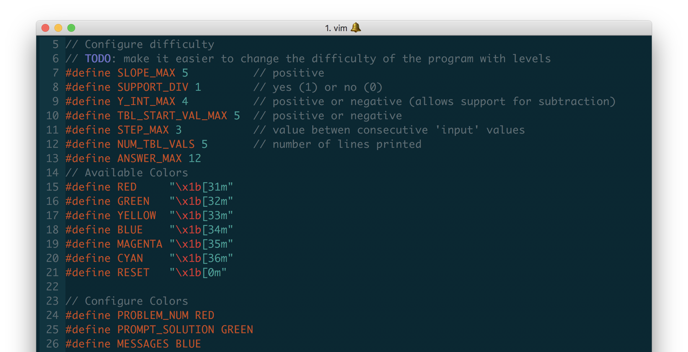

# paiges-patterns
A command line game that generates pattern tables, helping kids learn math and reasoning skills.

## Why
Over Christmas break my little sister needed practice problems for her math test.

*Something like this...*

Input (x) | Output (y)
------|-------
0   |   3
1   |   6
2   |   9
3   |   12
n   |   

This program exceeds the expectations of a few examples giving students like her the chance to tweak the level of difficulty and learn at their own pace with an "infinite" amount of problems.

## Usage
Compile with the provide Makefile
```
#creates an executable
make

#runs the executable
./startGame
 ```


## Customize
Difficulty and color preferences can be found and managed at the top of patternPractice.c


## Future Improvements
- Fix: Random seed based on time
- Feature: Levels
- Refactor: Break into multiple source and header files
- Redesign: GUI (instead of command line interface)
